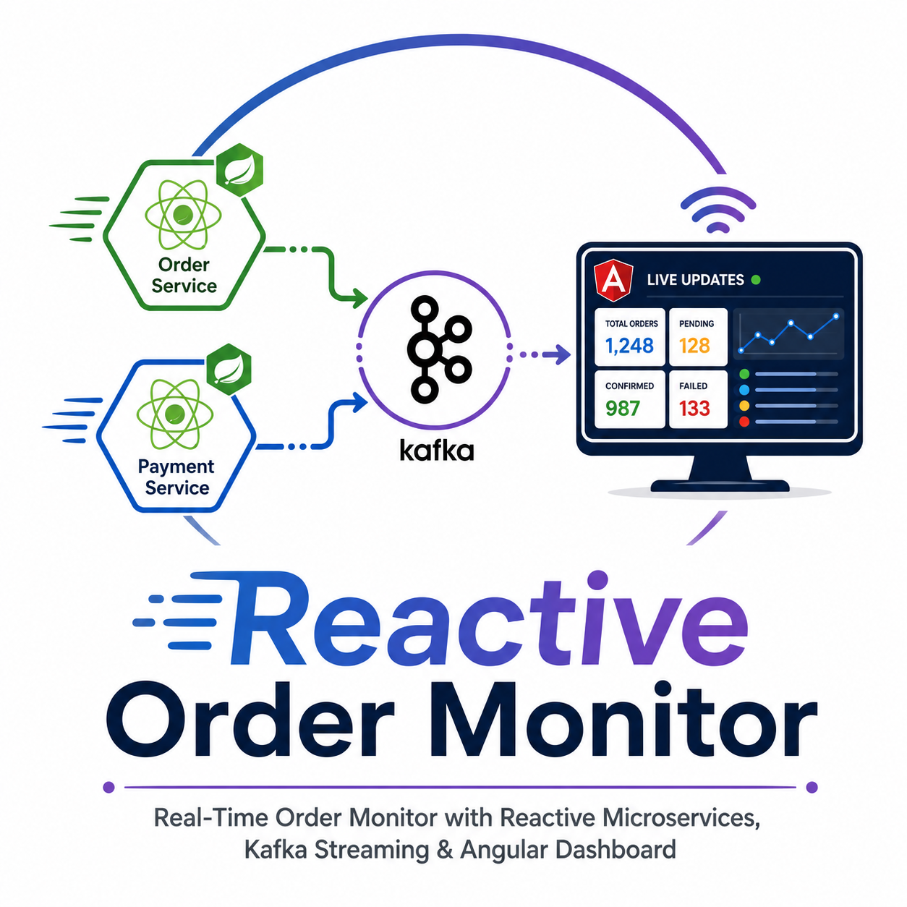
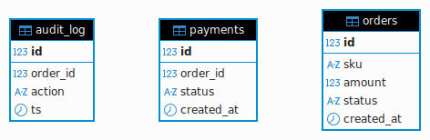
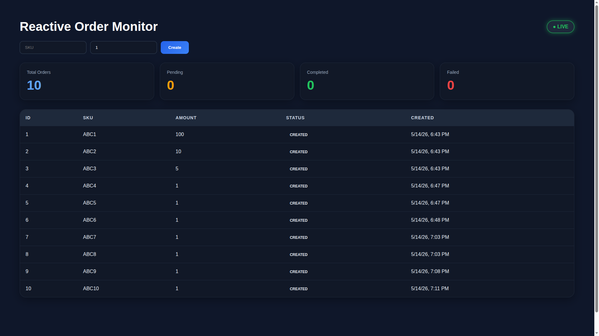

# Reactive Order Monitor

Real-Time Order Monitor with two reactive microservices, Kafka in the middle, and an Angular dashboard streaming live updates



## Project Structure

```
.
├── bdd-tests
│   ├── pom.xml
│   └── src
│       └── test
│           ├── java
│           │   └── mlocks
│           │       └── bdd
│           │           ├── RunCucumberTest.java
│           │           └── steps
│           │               ├── OrderSteps.java
│           │               └── StreamSteps.java
│           └── resources
│               ├── features
│               │   ├── order_enriched.feature
│               │   ├── order.feature
│               │   └── order_stream.feature
│               ├── junit-platform.properties
│               └── openapi
│                   └── order-api.yaml
├── docker-compose.yml
├── ER_db_model.png
├── .gitignore
├── .idea
├── LICENSE
├── .mvn
│   └── wrapper
│       └── maven-wrapper.properties
├── mvnw
├── order-service
│   ├── pom.xml
│   └── src
│       └── main
│           ├── java
│           │   └── mlocks
│           │       └── orders
│           │           ├── config
│           │           │   ├── JacksonConfig.java
│           │           │   └── KafkaConfig.java
│           │           ├── controller
│           │           │   ├── KafkaProducer.java
│           │           │   └── OrderController.java
│           │           ├── dto
│           │           │   ├── EnrichedOrder.java
│           │           │   ├── OrderRequest.java
│           │           │   └── PaymentStatus.java
│           │           ├── model
│           │           │   ├── Audit.java
│           │           │   ├── OrderEvent.java
│           │           │   └── Order.java
│           │           ├── OrderServiceApplication.java
│           │           └── repository
│           │               ├── AuditRepository.java
│           │               └── OrderRepository.java
│           └── resources
│               ├── application.yml
│               └── schema.sql
├── payment-service
│   ├── pom.xml
│   └── src
│       └── main
│           ├── java
│           │   └── mlocks
│           │       └── payment
│           │           ├── config
│           │           │   └── KafkaConfig.java
│           │           ├── controller
│           │           │   └── PaymentController.java
│           │           ├── model
│           │           │   ├── OrderEvent.java
│           │           │   └── Payment.java
│           │           ├── PaymentServiceApplication.java
│           │           ├── repository
│           │           │   └── PaymentRepository.java
│           │           └── service
│           │               └── PaymentProcessor.java
│           └── resources
│               ├── application.yml
│               └── schema.sql
├── Reactive Order Monitor.postman_collection.json
├── README.md
├── realtime-reactive-order-monitor.png
├── ui
│   ├── angular.json
│   ├── package.json
│   ├── proxy.conf.json
│   ├── src
│   │   ├── app
│   │   │   ├── app.component.ts
│   │   │   ├── components
│   │   │   │   └── order-list
│   │   │   │       ├── order-list.component.css
│   │   │   │       ├── order-list.component.html
│   │   │   │       └── order-list.component.ts
│   │   │   ├── models
│   │   │   │   └── order.model.ts
│   │   │   └── services
│   │   │       └── order.service.ts
│   │   ├── favicon.ico
│   │   ├── index.html
│   │   ├── main.ts
│   │   ├── polyfills.ngtypecheck.ts
│   │   ├── polyfills.ts
│   │   └── styles.css
│   ├── tsconfig.app.json
│   └── tsconfig.json
└── ui-screenshot.png

44 directories, 62 files
```

## Running the application

Prerequisites
- Java Development Kit (JDK) 17 or above installed on your machine

Make ``maven`` script executable in the project directory root:

```bash
$ chmod +x mvnw
```

Start the containers using Docker Compose with the following command:

```bash
$ docker-compose up
```

To stop the containers, run:

```bash
$ docker-compose down
```

Type the following three commands in directory ``order-service`` to install dependencies and start the service:

```bash
$ cd order-service/
$ ../mvnw install
$ ../mvnw spring-boot:run
```

The service will run on ``http://localhost:8081/api/``

Do the same in the directory ``payment-service`` (install dependencies and start the service):

```bash
$ cd payment-service/
$ ../mvnw install
$ ../mvnw spring-boot:run
```

The service will run on ``http://localhost:8082/api/``


## Database Model

The database is very simple, only containing three tables.



## Frontend

Check if you have a recent version of [Node.js](https://nodejs.org/) (which comes bundled with [npm](https://www.npmjs.com/), a JavaScript package manager):

```bash
$ node -v
```

```bash
$ npm -v
```

In the ``ui`` directory install all the dependencies and libs:

```bash
$ cd ui/
$ npm install
```

Run the following command:

```bash
$ npm run start
```

And then access [http://localhost:4200/](http://localhost:4200/) on your browser.



## Cucumber Tests

Type the following commands in directory ``bdd-tests`` to install dependencies and run the tests:

```bash
$ cd bdd-tests/
$ ../mvnw install
$ ../mvnw test
```

The output must be like this:

```bash
$ ../mvnw test
[INFO] Scanning for projects...
[INFO] 
[INFO] --------------------------< mlocks:bdd-tests >--------------------------
[INFO] Building bdd-tests 1.0.0
[INFO]   from pom.xml
[INFO] --------------------------------[ jar ]---------------------------------
[INFO] 
...
[INFO] 
[INFO] -------------------------------------------------------
[INFO]  T E S T S
[INFO] -------------------------------------------------------
[INFO] Running mlocks.bdd.RunCucumberTest

Scenario: Valid order is persisted and event published  # features/order.feature:3
SLF4J: Failed to load class "org.slf4j.impl.StaticLoggerBinder".
SLF4J: Defaulting to no-operation (NOP) logger implementation
SLF4J: See http://www.slf4j.org/codes.html#StaticLoggerBinder for further details.
  Given the system is clean                             # mlocks.bdd.steps.OrderSteps.clean()
  When I POST /api/orders with sku "ABC" and amount 100 # mlocks.bdd.steps.OrderSteps.post(java.lang.String,int)
  Then response status is 201                           # mlocks.bdd.steps.OrderSteps.status(int)
  And response matches OpenAPI spec                     # mlocks.bdd.steps.OrderSteps.validateContract()
  And order is stored in database                       # mlocks.bdd.steps.OrderSteps.dbCheck()
Kafka event received: {"orderId":1,"type":"CREATED","ts":"2026-05-14T14:17:34.974324117Z"}
  And event "CREATED" is published to Kafka             # mlocks.bdd.steps.OrderSteps.kafkaCheck(java.lang.String)

Scenario: Order returns with payment status from payment-service # features/order_enriched.feature:3
  Given an order exists with sku "ENR1" and amount 10            # mlocks.bdd.steps.OrderSteps.createOrder(java.lang.String,int)
  And payment for the last order is completed                    # mlocks.bdd.steps.OrderSteps.paymentCompleted()
  When I GET /api/orders/{id}/enriched for the last order        # mlocks.bdd.steps.OrderSteps.getEnriched()
  Then response status is 200                                    # mlocks.bdd.steps.OrderSteps.status(int)
  And response contains payment.status "AUTHORIZED"              # mlocks.bdd.steps.OrderSteps.checkPayment(java.lang.String)
  And response matches OpenAPI spec                              # mlocks.bdd.steps.OrderSteps.validateContract()

Scenario: New order appears on stream in real time                  # features/order_stream.feature:3
  Given I am subscribed to order stream                             # mlocks.bdd.steps.StreamSteps.subscribe()
  When I POST /api/orders with sku "STREAM1" and amount 5           # mlocks.bdd.steps.OrderSteps.post(java.lang.String,int)
  Then stream receives an order with sku "STREAM1" within 5 seconds # mlocks.bdd.steps.StreamSteps.verify(java.lang.String,int)
[INFO] Tests run: 3, Failures: 0, Errors: 0, Skipped: 0, Time elapsed: 8.628 s -- in mlocks.bdd.RunCucumberTest
[INFO] 
[INFO] Results:
[INFO] 
[INFO] Tests run: 3, Failures: 0, Errors: 0, Skipped: 0
[INFO] 
[INFO] ------------------------------------------------------------------------
[INFO] BUILD SUCCESS
[INFO] ------------------------------------------------------------------------
[INFO] Total time:  10.787 s
[INFO] Finished at: 2026-05-14T16:54:26-03:00
[INFO] ------------------------------------------------------------------------

```


## Endpoints

A Postman collection of endpoints is located in the file [Reactive Order Monitor.postman_collection.json](https://github.com/julianomacielferreira/reactive-order-monitor/blob/main/Reactive%20Order%20Monitor.postman_collection.json) and
below are example cURL calls to the endpoints.

- **`POST` /api/orders** (Create new order)

```bash
$ curl --location 'http://localhost:8081/api/orders' \
--header 'Content-Type: application/json' \
--data '{
    "sku": "ABCD",
    "amount": 100
}'
```

<details>
<summary><b>Response</b></summary>

```json
{
    "id": 5,
    "sku": "ABCD",
    "amount": 100,
    "status": "CREATED",
    "createdAt": "2026-05-12T19:54:16.406162538Z"
}
```
</details>

---

- **`GET` /api/orders/stream** (Retrieve all orders)

```bash
$ curl --location 'http://localhost:8081/api/orders/stream'
```

<details>
<summary><b>Response</b></summary>

```json
data:{"id":5,"sku":"ABCD","amount":100,"status":"CREATED","createdAt":"2026-05-12T19:54:16.406163Z"}

data:{"id":4,"sku":"ABCD","amount":100,"status":"CREATED","createdAt":"2026-05-12T19:29:21.344336Z"}

data:{"id":3,"sku":"ABCD","amount":100,"status":"CREATED","createdAt":"2026-05-12T19:28:49.163356Z"}

data:{"id":2,"sku":"ABCD","amount":100,"status":"CREATED","createdAt":"2026-05-11T13:40:42.397927Z"}
```
</details>

---

- **`GET` /api/orders/:orderId/enriched** (Retrieve order by primary key)

```bash
$ curl --location 'http://localhost:8081/api/orders/1/enriched'
```

<details>
<summary><b>Response</b></summary>

```json
{
  "order": {
    "id": 3,
    "sku": "ABCD",
    "amount": 100,
    "status": "CREATED",
    "createdAt": "2026-05-12T19:28:49.163356Z"
  },
  "payment": {
    "status": "AUTHORIZED"
  }
}
```
</details>

---

- **`GET` /api/payments/:orderId** (Retrieve order payment by primary key)

```bash
$ curl --location 'http://localhost:8082/api/payments/1'
```

<details>
<summary><b>Response</b></summary>

```json
{
  "id": 1,
  "orderId": 1,
  "status": "AUTHORIZED",
  "createdAt": "2026-05-11T13:40:35.722187Z"
}
```
</details>

---

## References

- [**Spring Boot**](https://spring.io/projects/spring-boot)
- [**MDN Web Docs**](https://developer.mozilla.org/)
- [**IntelliJ IDEA Community Edition**](https://www.jetbrains.com/idea/download/?section=linux)
- [**Docker**](https://www.docker.com/)
- [**Angular**](https://angular.io/)
- [**Apache Kafka**](https://kafka.apache.org/)
- [**Cucumber**](https://cucumber.io/docs/tools/java/)

## License

Please see the [license agreement](https://github.com/julianomacielferreira/reactive-order-monitor/blob/main/LICENSE).